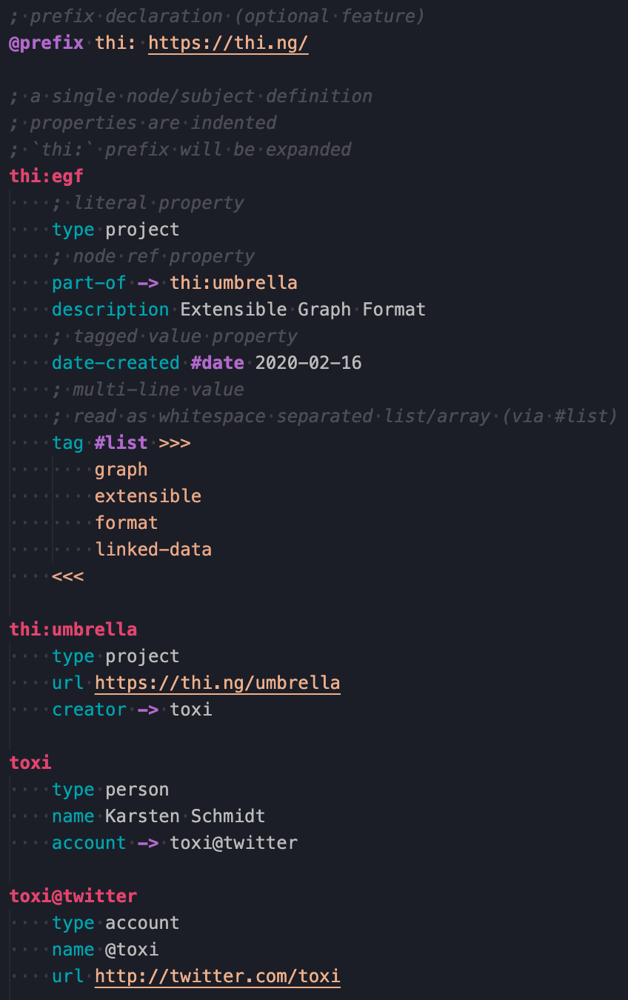

# Extensible Graph Format editor support

## Features

This extension provides [EGF syntax](https://thi.ng/egf) highlighting and some
useful snippets for editing EGF files.

## Release Notes

### 0.0.1 (2020-09-15)

Initial release
